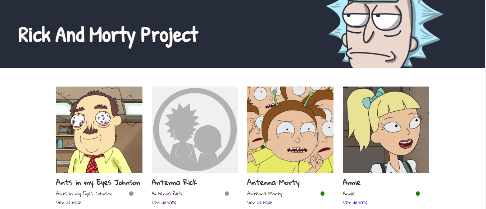
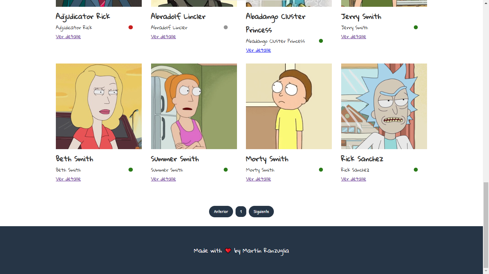
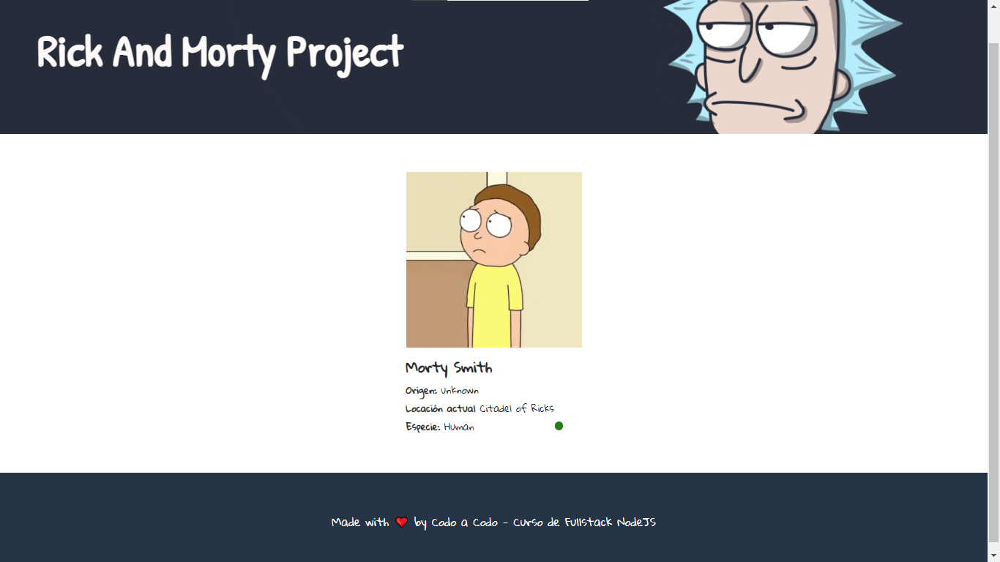

# 🚀 RICK & MORTY API PROJECT

### Recolección y manejo de datos mediante fetch y su posterior manejo en el DOM, con paginación incluida.

## ⚙ Lenguajes utilizados:

- HTML
- CSS
  - Flexbox
  - Grid
- JAVASCRIPT 

__Autor: Martín Ranzuglia & Programa Codo a Codo